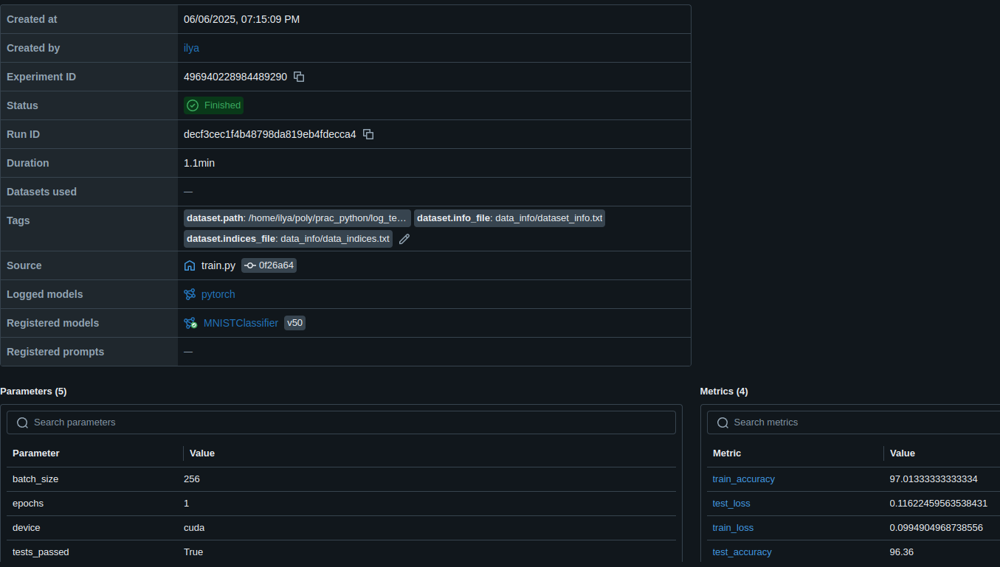
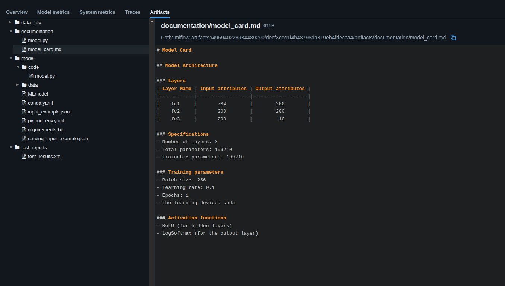
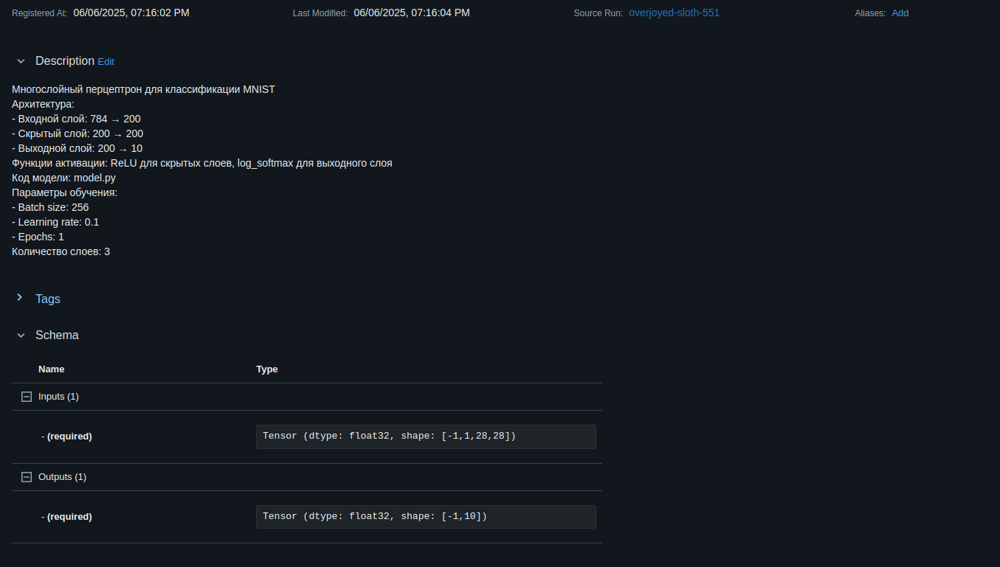

# MNIST Classification Project

## Описание

Этот проект выполняет обучение и логирование модели классификации изображений MNIST с использованием PyTorch и MLflow.  
Основная точка входа — функция main() в train.py.

---

## Структура проекта

├── config.py  
├── model.py  
├── train.py  
├── train_utils.py  
├── tests/  
│   ├── __init__.py  
│   └── test_model.py  
└── .venv/

---

##  Основные файлы

- train.py  
  Стартовая точка программы. Функция main() создаёт и обучает модель.

- model.py  
  Содержит описание архитектуры модели.

- train_utils.py  
  Содержит вспомогательные функции для обучения и работы с моделью.

- config.py  
  Файл с конфигурацией:
  
  BATCH_SIZE = 256  
  LEARNING_RATE = 0.1  
  EPOCHS = 1  
  DEVICE = torch.device('cuda' if torch.cuda.is_available() else 'cpu')

- tests/test_model.py  
  Логирование тестов с помощью функции run_and_log_tests().

---

##  Логирование

- Функции get_loaders() и train_model() из train_utils.py обёрнуты декораторами log_loaders и log_train_model и выполняют основное логирование.

- Метрики train_loss, train_accuracy, test_loss, test_accuracy логируются функцией evaluate_and_log_metrics() из train.py.

- Тесты логируются с помощью run_and_log_tests() из tests/test_model.py.

---

## Важные предупреждения

При запуске может появляться предупреждение:  
"Registered model 'MNISTClassifier' already exists."  
Это значит, что при каждом запуске создаётся новая версия одной и той же модели. Это нормальное поведение.

---

## 💻 Запуск MLflow UI (Arch Linux)

1. Активировать виртуальное окружение:  
   source .venv/bin/activate.fish

2. Запустить MLflow UI:  
   mlflow ui

3. Перейти в браузере:  
   http://127.0.0.1:5000

---

## Просмотр результатов

В MLflow UI:
- Открыть Experiments → MNIST_Classification.
- Выбрать нужный запуск.

На странице запуска:
- Overview — основная информация.
- Artifacts:
  - data_info/ — данные о датасетах.
  - documentation/ — документация о запуске.
  - test_reports/ — отчёты о тестах.
- В model/data:
  - model.pth — сохранённые веса модели.
  - pickle_module_info.txt — информация о сохранении.

Информацию о созданной модели можно посмотреть во вкладке Models в MLflow UI.

---

## Используемые библиотеки

torch  
torchvision  
torch.nn  
torch.nn.functional  
torch.optim  
torch.utils.data  
mlflow  
mlflow.data  
mlflow.tracking  
pytest  
datetime  
pathlib  
os  
inspect  
functools  
math
